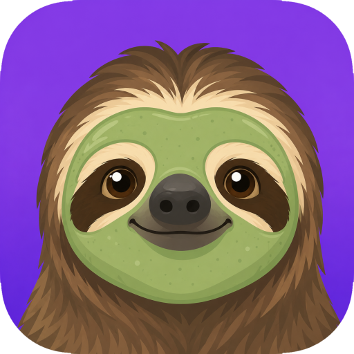
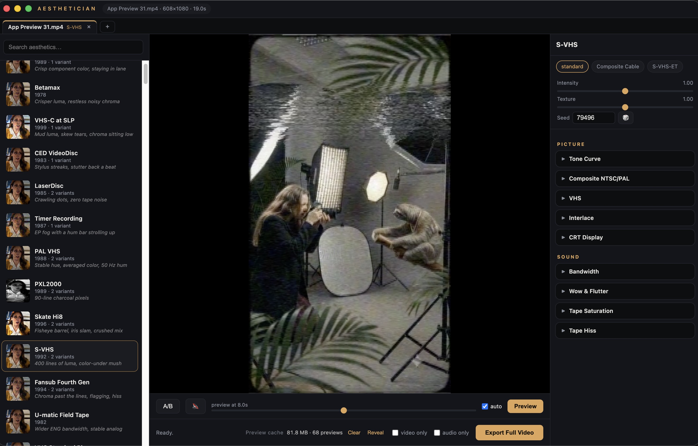

<p align="center">
  
</p>

<h1 align="center">Aesthetician</h1>

<p align="center">
  <a href="https://heresalexandria.github.io/aesthetician/">Download for macOS or Windows</a>
</p>

<p align="center">
  
</p>

**A premium archival-media aesthetic engine.** Aesthetician applies era-authentic looks, and sounds, to modern video and audio: VHS in a dozen states of decay, three-strip Technicolor, 16mm news film, Saturday-morning cartoons, dying broadcast signals, early web video, and much more.

It is not a filter pack. Every aesthetic is a physically-motivated simulation of the original signal path.

## What you get

| | |
|---|---|
| **426 presets** | 18 families: film (93), broadcast (57), audio-only (54), world cinema (45), digital (33), VHS (30), cartoon (22), captions (14), modern (14), arthouse (10), archive (9), decay (8), exhibition (7), stylized (7), western (7), transmission (6), print (6), adjust (4) |
| **680 variants** | alternate states of each look: clean transfers, worn prints, fifth-generation dubs, storm reception, terminal decay |
| **114 effects, 692 parameters** | every one exposed and documented, in the app and from the CLI |
| **84 overlay plates, 10 ambience beds** | AI-generated dust, leaks, burns, mould, water staining, CRT glare; synthesized projector, VCR and room tones |

## Features

- **Drag and drop video *or* audio.** Drop a WAV, MP3 or FLAC and the picture controls step aside, leaving only the sound chain.
- **Session tabs.** Open as many clips as you like, each with its own aesthetic and knob positions. Try one clip several ways side by side; switching back is instant.
- **Live previews through the real engine.** What you see is what exports. Hold **A/B** to flash the untreated original.
- **Source-preserving historical treatments.** Capture, stock, carrier and playback can span the 1890s through the 2010s without inventing cuts, cropping or rearranging the picture, adding graphics or replacing the supplied program audio.
- **Thumbnails and taglines.** Every row in the browse list previews that treatment (hover to see it move) with a one-line summary of its artifacts.
- **Search, filters and favorites.** Family chips and an era dropdown narrow the full library; star the keepers and they float to the top, across launches.
- **Audition the catalog with ↑ / ↓.** Step through the list you filtered down to and every stop renders, so you can run a whole family past the player without touching the mouse.
- **Save your own aesthetics.** Once a preset is dialled in, save the knobs, dials and seed under your own name. Saved looks sit at the top of the list with a ✎ badge, have their own filter, and name the files they export.
- **Editable on-screen text.** Camcorder date stamps, security clocks, tape counters and channel labels are yours to set - a real date picker for the clock, and one switch to turn the whole overlay off.
- **Export several at once.** Start an export and keep working; a queue at the top right shows every job with its own progress bar, and cancels or reveals them one by one.
- **Preview, tuned to your patience.** Pick the preview's length (2 to 8 s) and resolution (25 to 100%); exports always render full quality. Pause the loop when it gets distracting.
- **Keyboard-friendly.** ⌘O open, ⌘E export, ↑/↓ through the list, Space play/pause, hold B for the original, / to search.
- **Hover tooltips on every knob.** What the parameter physically models, its range, and the `--set` path to reach it from the CLI.
- **Two master dials.** **Intensity** for damage, warping and glow; **Texture** for grain and noise alone, so a look can go completely clean without losing its colour and character.
- **Deterministic.** Same seed, same render, every time. Roll the dice for a different take on the same aesthetic.
- **A preview cache you control.** Size and file count in the footer, with Clear and Reveal.
- **A real CLI** for batch and scripted work, with every parameter overridable.

## The simulations, in brief

- **Composite NTSC/PAL** is actually encoded onto a subcarrier and decoded like a receiver: dot crawl genuinely crawls, cross-color rainbows shimmer on fine detail, hue jitters per scanline, and an adaptive comb filter kills hanging dots exactly where a late-80s set would.
- **VHS** models color-under chroma, VCR edge-enhancement ringing, head-switch bending, azimuth herringbone, a two-head chroma beat, comet-tail dropouts written by a compensator holding the line above, tracking storms, time-base error and generation loss.
- **Film** gets living multi-scale grain with per-layer colour-negative sizing and emulsion mottle, red halation, gate weave, hand-crank flicker, refracting emulsion scratches, splice jumps, static-discharge flashes and dye-fade profiles.
- **Decay** goes where archives fear to: five-stage nitrate decomposition, vinegar-syndrome warp with layers physically separating, water tide marks, mould creep, sticky-shed tape.
- **Digital-era looks run the real codecs**: MPEG-1/2/4, H.264/AVC, MS-MPEG4, FLV, H.263 and MJPEG at era bitrates, plus true bitstream-corruption datamosh decoded through error concealment.
- **Print** does real rotated-screen CMYK halftone with genuine rosettes, photocopy generation collapse, red-blind microfilm and two-ink risograph.
- **Audio** is treated with the same seriousness: wow and flutter from an integrated speed curve, tape saturation with head bump, Dolby mistracking, vinyl crackle and warp thump, optical-track noise, synthesized projector clatter, shortwave RTTY interference, era telephones with real mu-law, real AAC/MP3/AMR/G.726 round-trips, and seventeen period speaker recipes.

## Setup (macOS)

```bash
brew install ffmpeg                    # if not already present
python3 -m venv .venv
.venv/bin/pip install -e .
cd app && npm install && cd ..        # for the GUI
```

Optional one-time generation (asset plates need `OPENAI_API_KEY` in `.env`, see `.env.example`):

```bash
.venv/bin/aesthetician assets generate
```

```bash
.venv/bin/python scripts/make_thumbs.py
```

## GUI

```bash
cd app && npm start
```

Full walkthrough: [docs/app-guide.md](docs/app-guide.md).

## CLI

```bash
aesthetician list                          # every preset, by family
aesthetician info vhs-camcorder-1989       # every knob, range, and variant
aesthetician apply clip.mp4 -p vhs-rental-1992
aesthetician apply clip.mp4 -p musical-1952 --variant worn-print --seed 42
aesthetician apply clip.mp4 -p vhs-ep-longplay --set vhs.tracking_error=0.6 \
    --set a_wow_flutter.wow_depth=14 --intensity 1.3 --texture 0.5
aesthetician preview clip.mp4 -p news-film-1975    # fast 3 s look
aesthetician apply song.wav -p audio-cassette-1984 # an audio file as the source
aesthetician apply clip.mp4 -p grindhouse-1973 --video-only
```

Any parameter shown by `info` can be overridden with `--set effect.param=value`
(audio effects start with `a_`). `--seed` pins the stochastic character,
`--intensity` scales damage and warping, `--texture` scales grain and noise.

## Desktop app (packaged)

Install the latest ready-made build from the
[Aesthetician download page](https://heresalexandria.github.io/aesthetician/).
It includes the app, engine, Python runtime, FFmpeg, and preset assets.

To build an installable app that needs no Python, ffmpeg or checkout:

```bash
python3 scripts/package/build.py --target mac
```

Artifacts land in `app/dist/`: a DMG on macOS (~495 MB, ~960 MB installed, almost
all of it NumPy/SciPy/OpenCV), an NSIS installer on Windows. The bundle carries a
relocatable CPython, static ffmpeg, and the asset packs.

### First run on macOS

The build is **ad-hoc signed** (there is no Apple Developer ID in this project),
which is enough to run locally but not enough to satisfy Gatekeeper on a
downloaded or copied DMG. The first launch will be blocked, showing a refusal or
*"Aesthetician is damaged and can't be opened"*. Either right-click the app and
choose **Open**, or clear the quarantine flag:

```bash
xattr -dr com.apple.quarantine /Applications/Aesthetician.app
```

After that it opens normally. Real distribution needs a Developer ID plus
notarization, see [docs/packaging.md](docs/packaging.md), which also covers the
GPL obligations that come with the bundled ffmpeg.

Windows builds are produced by CI on every release, and the packaged `.exe` is
launched and smoke-tested there before the release goes out.

### Staying current

The title bar shows the running version. Click it for the about dialog and a
**Check for updates** button; the app also checks once a day on its own and puts
an **Update available** button next to the version when there is something newer.
Taking that update downloads the release from GitHub, verifies its checksum,
replaces the installed copy and restarts - no browser, and no Gatekeeper prompt.
Exports in flight block an update until they finish or are canceled.

The same dialog lists every published release under **Other versions**, so a
specific one can be installed on demand - including an older one, for pinning
down which release a bug arrived in or stepping back off a bad build.

See [docs/updates.md](docs/updates.md).

## Releases

Releases are cut by CI from a labelled pull request: label it `major`, `minor` or
`patch`, merge it, and the version bump, the binaries and the release notes
follow by themselves. [docs/releases.md](docs/releases.md) has the details and
the one-time repository setup.

## Documentation

- [docs/app-guide.md](docs/app-guide.md) - using the desktop app
- [docs/usage.md](docs/usage.md) - setup and CLI workflows
- [docs/catalog.md](docs/catalog.md) - all 426 presets and every knob
- [docs/historical-coverage.md](docs/historical-coverage.md) - crosswalk for the 200-look historical brief
- [docs/packaging.md](docs/packaging.md) - building installable macOS/Windows apps
- [docs/releases.md](docs/releases.md) - how a release is cut, and the CI setup it needs
- [docs/updates.md](docs/updates.md) - how the app updates itself
- [docs/architecture.md](docs/architecture.md) - how the engine works
- [docs/preset-authoring.md](docs/preset-authoring.md) - writing new presets

## Development

```bash
.venv/bin/python tests/test_engine.py         # engine unit tests
node tests/test_updater.js                    # updater decisions
.venv/bin/python tests/test_smoke.py          # end-to-end render
.venv/bin/python scripts/validate_presets.py  # preset/registry consistency
.venv/bin/python scripts/audit_calibration.py # calibration guardrails
.venv/bin/python scripts/smoke_all_presets.py # batch-render every preset
.venv/bin/python scripts/make_gallery.py --family vhs --input videos-samples/untreated.mp4
```

No media files or secrets are ever committed. Sample footage lives untracked in
`videos-samples/`, generated assets in `assets/`.
